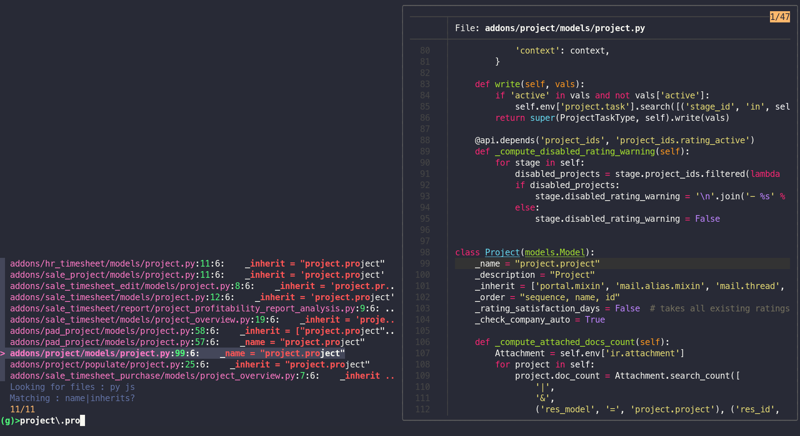

# oscout

###### [Installation] | [Guide]

[Installation]: #installation
[Guide]: #guide

Oscout is a small command line tool to explore Odoo source code. It uses ripgrep to recursively search the directory, fzf to select the matches and display a preview with bat.



## Guide

### Use

Run `oscout` in a directory.

Type in your query. (Note: regular expression meta characters like .(){}*+ have to be escaped)

Use shortcuts to refine the search
- `<alt-p>`, `<alt-j>`, `<alt-x>` are going to filter for .py, .js, .xml files
- `<alt-N>`, `<alt-I>`, `<alt-C>`, `<alt-D>` look for the query prefixed with `'name ='`, `'inherit ='`, `'class'`, `'def'` 
  
### Extend
Depending on what's to be modified, you could open an issue or a PR. 

##### Arguments
Arguments given to oscout will be forwarded to ripgrep.


##### Environment variables
Oscout will also source `~/.config/oscout/env_var.sh`
It can be a good place to :
- add executables to the `$PATH` for use in keybindings
- export `FZF_DEFAULT_OPTS` or `OSCOUT_RG_OPTS` with options for fzf and ripgrep respectively


##### Fzf event bindings
If the file `~/.config/oscout/bindings` exists, oscout will read it as well as the default one. Key and event binding for fzf can be added/modified there.
For example, to open the selected file with Sublime instead of bat, you can add :
```txt
enter:execute(subl {1}:{2}:{3})+accept
```
Note : the bindings files supports `#` comments but will break if they contain trailing whitespaces or trailing empty lines


## Installation
###### Dependancies
- [ripgrep](https://github.com/BurntSushi/ripgrep)
- [fzf](https://github.com/junegunn/fzf)
- [bat](https://github.com/sharkdp/bat)

###### Install

Clone the repository
```sh
git clone https://github.com/dutrieuc/oscout.git oscout && cd oscout
```
Symlink oscout in `~/.local/bin` to make it usable from everywhere 
```sh
./setup
```
